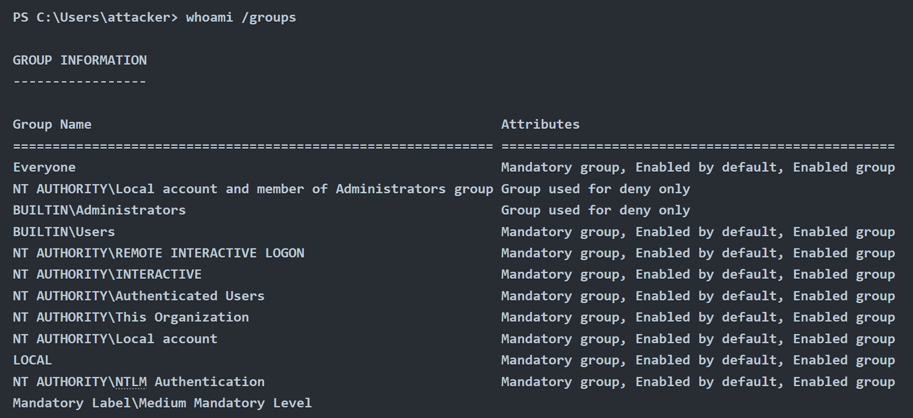

Después de tanto tiempo sin publicar nada por aquí, hoy me decido a publicar una nueva entrada en este blog. 
Esta vez se trata de como evadir el Control de Cuentas de Usuario (UAC) en hosts Windows. Vamos a ver formas comunes de eludir la función de seguridad disponible que tiene implementado Windows, conocido como User Account Control.
Esta característica permite que cualquier proceso se ejecute con privilegios bajos (independientemente de quien lo esté ejecutando). 

Desde la perpesctiva de un atacante, eludir UAC es esencial para poder salir de entornos restrictivos y elevar los privilegios en el host objetivo. También mientras aprendemos técnicas de bypass, veremos cualquier alerta que se pueda activar y artefactos que podrían crearse el sistema y que el Blue Team pueda detectar.

Para poder entender esta sala, recomiendo que se tenga conocimientos básicos de como funciona Windows en su núcleo.

#  ¿Qué es UAC?
User Account Control es una funcion de seguridad en Windows, que en su medida, obliga a cualquier proceso nuevo se ejecute en el contexto de una cuenta sin privilegios. 
Esta política es implementada a los procesos iniciados por cualquier usuario, incluido los administradores del sistema. La idea es que no podemos basarnos solamente en la identidad del usuariuo para determinar si se debenm autorizar ciertas acciones.

Aunque suene contradictorio, imaginemos el caso de un usuario llamado Bob que descarga sin saber un aplicación maliciosa de Internet. Si Bob forma parte del grupo de administradores, cualquier aplicacion que inicie heredará sus privilegios de token de acceso. 

Por tanto, si Bob decide iniciar una aplicación maliciosa y el UAC esta disabled, esta obtendra los privilegios deadministrador al instante. En cambio, la aplicacón quedara restringida a un token de acceso no administrativo cuando el UAC este habilitado.

#  Elevación UAC
Si se requiere que un admin haga una tarea administrativa, UAC proporciona una forma de elevar privlegios. La elevación funciona presentado un cuadro simple al usuario para confirmar que aprueba explicitamente la aplicación.

En este blog no voy a explicar a fondo los Niveles de Integridad (IL) y el Control de Integridad Obligatorio (MIC). Pero básicamente se trata de un mecanismo que permite diferenciar usuariuos, procesos y recursos mediante el IL a cada uno. 

El MIC tiene prioridad sobre las DACL normales de Windows, por lo que puede estar autorizado a acceder a un recurso segun DACL (Discretionary Access Control Lists)

#  Bypassing UAC
Desde la perspectiva de un atacante, podrían haber situaciones en la que se accede a un host Windows desde una shell remota mediante el cmd.exe o PowerShell. Incluso desde una cuenta del grupo de Administradores, pero al interntar crear un usuario de puerta trasera por si se quiere entrar en el futuro, se obtendra el siguiente error.

Al verificar nuestros grupos asignados, podemos confirmar que nuestra sesión se ejecutando con un IL de por medio. Lo que significa que efectivamente estamos usando un token filtrado.

Como dato extra, al estar investigando. Microsoft no considera el Control de Cuentas de Usuario (UAC) como una limitación de seguridad, sino una simple comodidad para el administrador que evita la ejecución innecesaria de procesos con privilegios administrativos. En ese sentido, el aviso del UAC sirve más como recordatorio al usuario de que está ejecutando con privilegios elevados, en lugar de impedir que un malware o un atacante lo haga.

Al no ser una limitación de seguridad, ninguna técnica de evasión se considera una vulnerabilidad para Microsoft, por lo que algunas siguen sin parchearse a día de hoy. Curioso, ¿verdad?. Microsoft no para de sorprendernos.

#  UAC: Bypasses basados en GUI

#  Caso práctico: msconfig
Para todos los escenarios presentados aqui, se da por hecho que tenemos acceso al servidor con una cuenta con unos mínimos de privilegios administrativos, pero solo desde una consola de nivel de usuario medio. 
El objetivo en esta entrada, siempre será poder acceder a un nivel de usuario alto sin pasar por el UAC. Hablado esto, sigamos.

Nuestro objetivo aqui es obtener acceso a una terminal con alto nivel de IL sin pasar por el UAC. Primero, abrimos msconfig.

Si analizamos el proceso con Processhacker.exe notamos que aunque no se nos haya presentado el UAC, msconfig se ejecuta con proceso alto de IL. Lo podemos ver por el color naranja.

 Esto es posible gracias a una función llamada "auto elevation" que permite la elevacion de binarios sin la interacción del usuario.

 Vamos a lanzar una shell que heredaría el mismo token de acceso que esta usando msconfig, por lo tanto, se ejecutaría como un proceso de alto nivel de IL.

 

#  Caso práctico: azman.msc

 Al igual que hemos hecho con msconfig, azman.msc se ejecutará elevdamente sin necesidad de interacción por parte del usuario. Vamos a encontrar una forma de generar una shell desde ese proceso. Ten en cuenta que azman.msc n tiene una forma predefinida como msconfig para la generación de una shell. Pero esto se soluciona, con un poco de creatividad, veamos.

Al presionar la parte de artículo de ayuda, seleccionamos "Ver Fuente".

Esto generará un proceso en el bloc de notas que podemos usar para obtener una shell. Para ello vamos a "Archivo -> Abrir" y nos aseguramos de seleccionar todos los archivos. Ve a "C:\Windows\System32" y busca "cmd.exe" y haga click derecho para seleccionar abrir.

#  UAC: Procesos de autoelevación
#  AutoElevate
Para que una aplicación se eleve automaticamente, se deben de cumplir estos requisitos.
* El ejecutable debe estar firmado por el editor de Windows.
* El ejecutable debe estar contenido en un directorio confiable, como `%SystemRoot%/\System32/` o `%ProgramFiles%/`.
Dependiendo de la situación, pueden haber requisitos adicionales.
* Para un ejecutable .exe debe de declararse el elemento AutoElevate en el manifiesto. Para consultarlo, usamos sigcheck de SysInternals.

#  Caso de estudio: Fodhelper
Fodhelper.exe es uno de los ejecutables predeterminados de Windows, encargado de administrar las funciones opcionales de Windows, como idiomas adicionales, aplicaciones no instaladas por defecto u otras características del sistema operativo.

Como la mayoría de programas utilizados para la config del sistema, fodhelper puede autoelevarse al usar la configuración predeterminada del UAC, de modo que a los admin no se les solicite la elevacion al realizar tareas administrativas estandar. A diferencia de msconfig, que hemos visto que tiene autoelevate en True, fodhelper puede ser utilizado de forma abusiva sin tener acceso a una GUI.

Desde nuestra vista de Red Team, significa que se puede usar a través de una shell remota de IL media y aprovecharse para crear un proceso de alto IL funcional. Esta técnica fue descubierta por `@winscripting` y usado por el malware Glupteba

Lo que se observó sobre fodhelper es que busca una clave de registro especifica. 

Cuando Windows abre un archivo verifica en el registro que aplicación usar. El registro tiene una clave conocida como ProgID para cada tipo de archivo, donde se asocia la aplicación correspondiente.
Si el usuario abre un HTML, se consulta una parte del registro conocida como `HKEY_CLASSES_ROOT` para que el sistema sepa que debe de usarse un cliente web preferido para abrirlo. El comando a usar se especificará en el `shell/open/command`, subllave de ProgID de cada archivo.

Volvemos con fodhelper. Vemos que intenta abir un archivo con el ProgID de ms-settings. Al crear una asosicación para ese ProgID bajo HKCU anularemos la sociacion predeterminada del sistema. Entonces controlaremos que comando se usa para abrir el archivo. Dado que fodhelper es un ejecutable de autoElevate, cualquier subproceso generará un token de alta integridad, bypassing asi el UAC.

#  Atacando

Imaginemos que hemos instalado una backdoor en un servidor objetivo por comodidad. hemo slogrado crear una cuenta del grupo de Admin, pero el UAC impide la ejecución de tareas con privilegios. 
Nos conectamos a la puera trasera con netcat y configuramos los registros necesarios para asociar la clase ms-settings a una reverse shell.

Como resultado de esto, se crearon artefactos en el sistema objetivo en formas de clave de registro. Para evitar la detección debemos de limpiar el sistema con: `reg delete HKCU\Software\Classes\ms-settings\ /f`

Happy Hacking ^^

